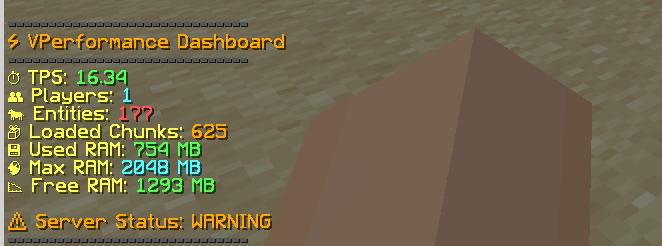

# ⚡ VPerformance

A modern Minecraft Paper performance monitoring plugin built for server owners and administrators.

## Features

### Performance Dashboard

Use:

```bash
/vpef
```

View:

* TPS
* RAM Usage
* Online Players
* Loaded Chunks
* Entity Count
* Server Health Status

### Help Menu

```bash
/vpef help
```

Displays all available commands.

### Support Command

```bash
/vpef support
```

Shows the developer support page.

---

## Compatibility

* Paper 1.21+
* Paper 1.21.1
* Paper 1.21.2
* Paper 1.21.3
* Paper 1.21.4
* Paper 1.21.5
* Paper 1.21.6
* Paper 1.21.7
* Paper 1.21.8
* Paper 1.21.9
* Paper 1.21.10
* Paper 1.21.11

Java 21 Required

---

## Commands

| Command       | Description                |
| ------------- | -------------------------- |
| /vpef         | Open performance dashboard |
| /vpef help    | Show help menu             |
| /vpef support | Support development        |

---

## Installation

1. Download the latest release.
2. Put the jar into your server's plugins folder.
3. Restart the server.
4. Use `/vpef`.

---

## 📸 Screenshots

### How it looks likes


---


## Developer

Created by NotVoid

Support:
https://kamauchanepali.com/tip/notvoid/

---

## License

MIT License
